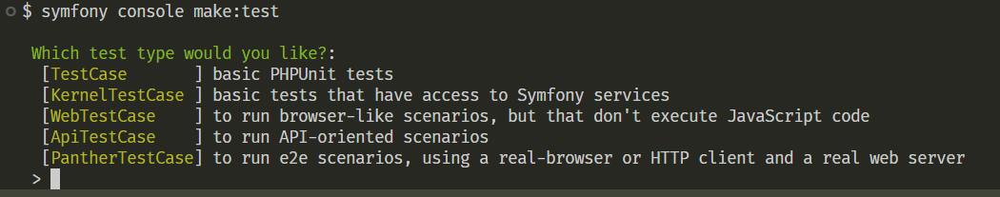

# Tests avec symfony

[📜 Lien de la doc officielle](https://symfony.com/doc/current/testing.html)

On a choisi durant tous les cours précédents de ne pas s'attarder sur les tests, et pourtant... C'est central, voire même primordial : le **test driven development**, le *Développement conduit par les tests* en français, est une pratique qu'on devrait voir au plus vite.

D'ailleurs, vous vous rappelez sans doute qu'à plusieurs reprises lorsqu'on faisait des commandes, symfony nous demandait si on voulait les tests unitaires qui allaient avec. On a répondu non, ou oui, mais sans savoir ce que cela faisait. 

Je vous propose de prendre ici le chemin des tests comme si on les avait inclus dans notre développement depuis le début. 

## Premier test
Comme à notre habitude, on va passer par des lignes de commandes :
```bash
symfony console make:test
```


Comme on peut le voir sur l'image, Symfony nous propose 5 types de tests différents. Les plus simples (TestCase) au plus complets (PantherTestCase), qui nous permettent de tester l'application à différents niveau : du test unitaire au test End to End (c'est-à-dire le parcours utilisateur complet, en émulation).

### Tests unitaires 
Commençons par les plus simples. Les tests unitaires nous permettent de tester un composant, une fonction, un service, indépendamment de tout le reste. 

Par exemple, on a envie d'utiliser le nom de nos films dans l'url, plutôt que l'ID. Mais le nom a des caractères spéciaux qui ne sont pas acceptables dans les url, et on veut les transformer en slug. On va donc se faire un service qui permet de transformer un titre en slug.

Dans l'idée de découvrir la logique du TDD, je vous propose de commencer par écrire les tests avant d'écrire la fonction correspondante.

#### Analyse du fichier 
```php
<?php

namespace App\Tests;

use PHPUnit\Framework\TestCase;

// 1. Notre classe hérite du TestCase, la classe de PHPUnit qui permet de lancer les tests

// 2. Le nom de la classe contient Test
class FunctionTest extends TestCase
{
    // 3. Le nom de la fonction commence par test en camelcase. On peut aussi écrire en snakeCase.
    public function testSomething(): void
    {
        // Les assertions nous permettent de vérifier des choses. Il peut y en avoir plusieurs dans une fonction, pour bien tout vérifier.
        $this->assertTrue(true);
    }
}
```

#### Exercice
Créer un test qui :
- construit un objet Film
- récupère le titre du film et le passe à un Service de Slug
- on vérifie alors que le slug correspont à ce à quoi on s'attend, par exemple :
  - un titre simple => un-titre-simple
  - ô titre accentué => o-titre-accentue
  - titre (copy) => titre-copy

Pour lancer le test, il faut évidemment que phpunit soit installé. Si ce n'est pas le cas, il faut l'installer :

```
composer require --dev phpunit/phpunit
composer require --dev symfony/phpunit-bridge
```
Les deux sont indispensables.

Pour lancer les tests, on fait ensuite la commande 
```bash
symfony phpunit
# ou
php bin/phpunit
```

Il est aussi possible d'installer une extension, [PHPUnit Test Explorer](https://marketplace.visualstudio.com/items/?itemName=recca0120.vscode-phpunit), qui permet de lancer les tests un par un, en cliquant à côté. très pratique pour avancer pas à pas.

Si vous lancez votre test, a priori il casse, parce qu'il ne trouve pas la fonction qui crée le slug. On va donc la construire.

Comme cette fonction de slug pourra être utile pour tout (film, catégorie, séance, ...), on va construire un trait, qui sera appelable ensuite par toutes les classes.


## Tests fonctionnel (KernelTestCase) 

Tester une fonction indépendamment du reste, c'est la base. Mais on a également besoin de savoir si tous nos composants fonctionnent correctement ensemble. On va donc faire des tests plus complets, qui vont tester des pans de l'application (souvent une méthode de controller, ou la validation d'une entité, ...)

Pour cela, on va avoir besoin de se connecter à la base de données, et Symfony nous permet d'effectuer les tests dans une base de données spécifique. 

Commencez par créer une nouvelle base de données avec phpmyadmin, généralement je garde le même nom que labase originale, suivi de `_test`. Vous avez un fichier `.env.test`, dans lequel vous pouvez modifier la ligne de BDD.

Une fois qu'on a fait ça, il faut la populer :
```bash
symfony console doctrine:migrations:migrate
symfony console doctrine:fixtures:load
```

Maintenant que la base est prête, il serait intéressant de savoir si nous arrivons bien à retrouver tous nos films par exemple.

voici la correction de ce premier test : 
```php
<?php

namespace App\Tests;

use App\Entity\Film;
use Symfony\Bundle\FrameworkBundle\Test\KernelTestCase;

class FilmTest extends KernelTestCase
{
    private $manager;
    private $repository;
    public function setUp(): void
    {
        self::bootKernel();
        $this->manager = self::getContainer()->get('doctrine')->getManager();
        $this->repository = $this->manager->getRepository(Film::class);
    }

    public function testFindAllFilms(): void
    {
        
        $films = $this->repository->findAll();

        // on en a mis 10 avec les fixtures
        $this->assertCount(10, $films);
    }
}
```
#### explications
J'ai choisi ici de regrouper tout ce qui servira à toutes mes méthodes dans une première méthode, `setUp`. Attention, ce nom n'est pas choisi au hasard. Pour les tests, `setUp` c'est un peu comme le constructeur pour un objet.
1. J'allume le kernel (le cœur de symfony)
2. je récupère le manager (Entity manager) grâce au container, une sorte de grand sac qui contient tous les outils de symfony
3. avec le manager, je peux récupérer le repository qui correspond à l'entité avec laquelle je vais travailler.

Ensuite, j'écris mon test : je récupère tous les films, et je vérifie qu'il y en a bien 10.

### Exercices
Faites les tests suivants :
- insertion d'un nouveau film en base de données
  - vous testerez :
    - la validation des infos avec le validator (un test qui doit passer, et un autre qui ne doit pas passer)
    - le bon enregistrement en BDD
    - la récupération de l'objet complet (avec id)
- mise à jour de ce dernier
  - vous testerez :
    - la validation des nouvelles données
    - la mise à jour du film qu'on vient de créer
    - la mise à jour d'un film qui n'existe pas
- suppression de ce dernier.
  - vous testerez :
    - la suppression du film qu'on vient de créer
    - la suppression d'un film qui n'existe pas
    - vous compterez le nombre de films après la suppression


## Tests E2E sans JS (WebTestCase) 
Jusque là, nous testions notre application que côté back. Mais ce qui est intéressant, c'est surtout l'interaction avec l'utilisateur. Sans rentrer dans les tests End to End très poussés, on peut déjà faire de sacrés trucs avec les webtestCases.

Pour découvrir cela, je vous propose de regarder ceux que symfony peut créer pour nous.

### Séance

Sur notre site de cinéma, nous voulons voir apparaitre les séances pour chaque film.
Nous devons donc commencer par créer une nouvelle entité.

On peut se faire rapidement des fixtures, et le crud avec les commandes adéquates. Lors de la création du crud, acceptez la création des tests correspondants, pour voir.

par défaut, les tests ne sont pas complets. Il faut venir les reprendre à la main. Super exercice ! 

Si vous lancez les tests, vous verrez que plusieurs seront sautés : en effet, il est possible de marquer les tests comme incomplets ou à sauter. 
```php
$this->markTestIncomplete();
$this->markTestSkipped();
```

Il faut donc enlever ces lignes pour pouvoir tester le code. 

Il est probable que les tests ne passent pas du premier coup. Prenez le temps de comprendre les erreurs, et de diagnostiquer les problèmes. Ce n'est jamais compliqué, c'est principalement parce que comme ces tests ne sont pas configurés, ils cassent.

### Conclusion
Je n'irai pas plus loin ici, vous avez déjà la possibilité de faire de belles choses ! Rappelez-vous :
- écrivez vos tests avant d'écrire votre code
- testez toutes les possibilités d'un code
- testez le plus possible de fonctions et à des échelles différentes (unitaires, fonctionnelles, E2E).